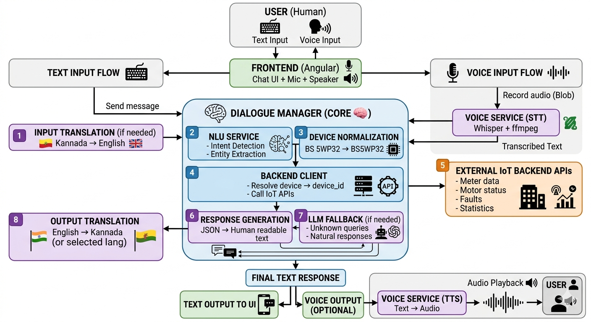

A chatbot based on LLM works by understanding user input, processing it using a large language model, and generating a meaningful response.

Basic chatbot archetecture consist of:
  1. User input the query through.
  2. Input is processed and converted in the format the model can understand.
  3. The LLM understands the context and generates a response based on training data.
  4. The response from the LLM is formatted to human language and sent back to the user.

During my internship I have worked on building a web chatbot on the real time project.
I have built a multilingual chatbot with voice input and output using local LLM to process the input and generate the output in human language.
The archetecture of the chatbot that i have built is given below:

